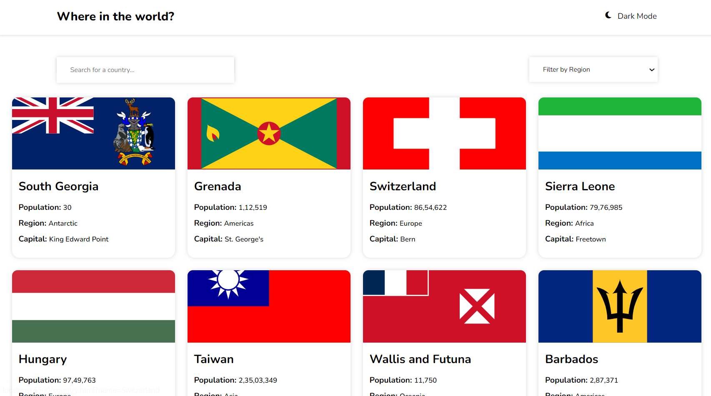
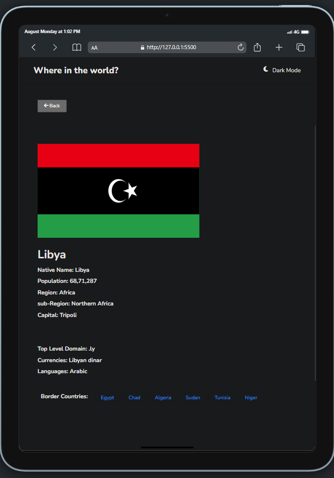

# Rest Countries Project

Welcome to the Rest Countries project! 🌍✨ This dynamic web application provides comprehensive information about countries around the world. Built using HTML, CSS, and JavaScript, this project demonstrates my ability to create a responsive, interactive, and user-friendly interface.

## 📜 Project Description

The Rest Countries project is a versatile web application designed to deliver real-time country data through a clean and interactive user interface. By leveraging the Rest Countries API, the app fetches and displays detailed information about countries, including names, populations, capitals, and more. 

### Key Features:

- **Real-Time Data Fetching:** The app pulls the latest country information from the Rest Countries API, ensuring users receive up-to-date details.
- **Search Functionality:** A robust search feature allows users to quickly find and filter countries by name or other attributes.
- **Responsive Design:** The application is fully responsive, offering an optimal viewing experience across various devices, from desktop monitors to mobile screens.
- **Interactive UI:** A modern and intuitive interface with smooth transitions and interactive elements enhances the user experience.

## 🔧 Technologies Used

- **HTML:** Provides the structure and semantic elements for the webpage.
- **CSS:** Delivers a responsive design and modern styling for a polished look and feel.
- **JavaScript:** Handles real-time data fetching, dynamic content updates, and search functionality.

## 📸 Screenshots

Explore the functionality and design of the project through the following screenshots:






These images showcase various aspects of the project, from the main homepage to detailed country information and responsive design across devices.

## 🎥 Video Demo

Watch the project in action through this video demo: [Video Demo](videoo.mp4). This video provides a walkthrough of the key features and functionality of the application.

## 🌐 Live Demo

Experience the live version of the project here: [Rest Countries Live Demo](https://restcountriessam.netlify.app/). Explore the full capabilities of the app and interact with the real-time data.

## 🛠️ Setup & Installation

To run this project locally, follow these steps:

1. **Clone the Repository:**
   ```bash
   git clone https://github.com/your-username/rest-countries-project.git
